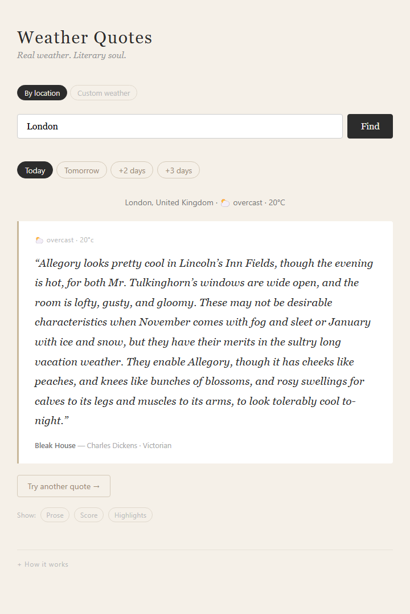
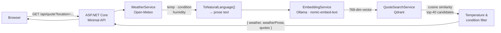
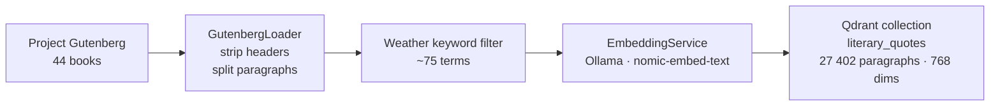
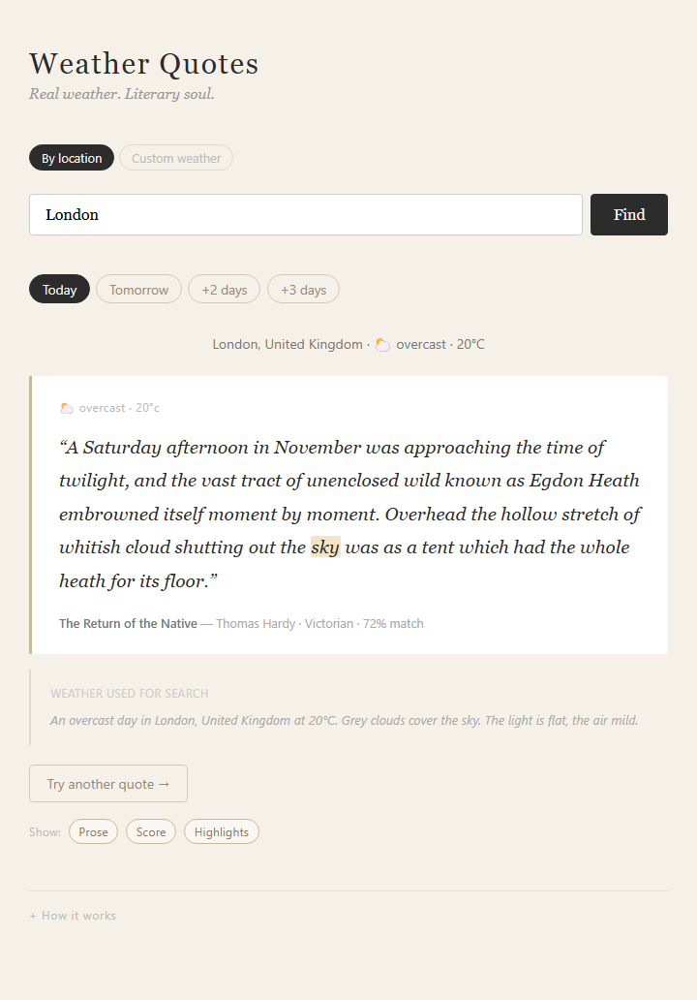
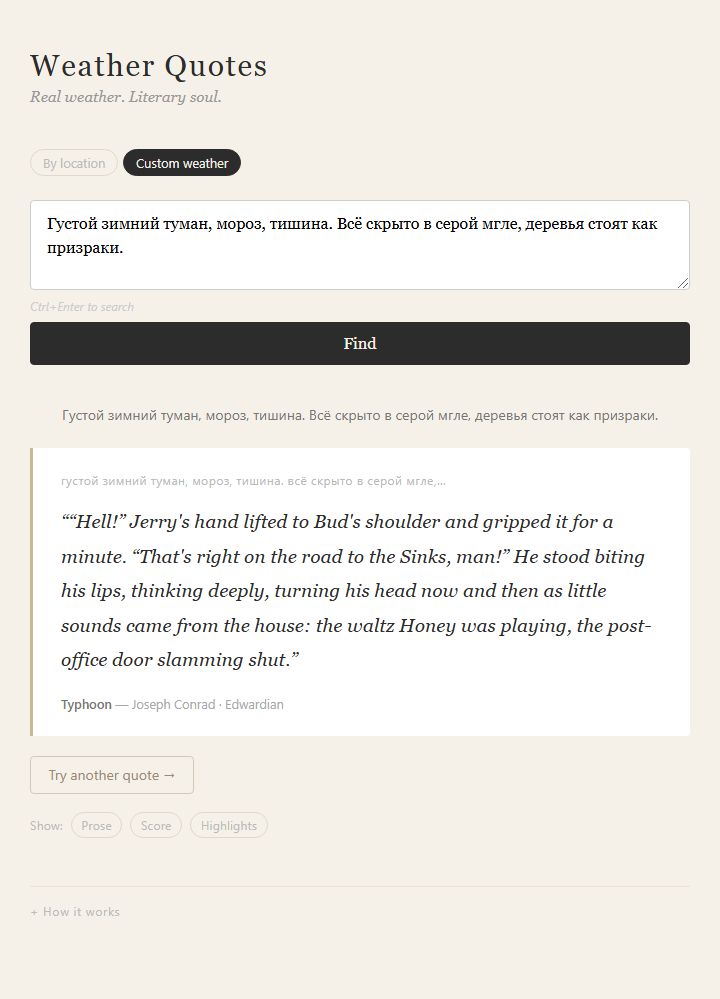

# Weather Quotes

> Real weather. Literary soul.

You type a city. The app finds the literary moment that matches the weather outside your window right now. A foggy morning becomes a passage from Dickens. An overcast London afternoon becomes Thomas Hardy. A Russian winter fog finds Joseph Conrad.



---

## How it works

The app fetches real weather for your city (temperature, condition, humidity) and converts those numbers into a short prose description — *"An overcast day in London at 20°C. Grey clouds cover the sky."* That description is embedded into a 768-dimensional vector using a local language model, then compared against ~27 000 weather-adjacent paragraphs extracted from 44 classic novels. The closest match is returned as your quote.

### Request pipeline



### Indexer pipeline (run once)



---

## Architecture

Two .NET 10 projects:

**`src/WeatherQuotes.Api`** — ASP.NET Core Minimal API + Alpine.js frontend served as static files.
- `GET /api/quote?location=<city>&offset=0..3` — current or forecast weather → quote
- `GET /api/quote/prose?text=<text>` — free-form description → quote (bypasses weather API)
- Services: `WeatherService` (Open-Meteo, no key), `EmbeddingService` (`Microsoft.Extensions.AI`), `QuoteSearchService` (Qdrant via gRPC)

**`src/WeatherQuotes.Indexer`** — one-time console app to populate the vector store.
- Downloads books from Project Gutenberg automatically
- Strips headers, splits into paragraphs (120–1200 chars), filters by weather keywords, embeds, upserts
- Resume-from-checkpoint: skips already-indexed paragraphs by reading the current Qdrant point count

**Qdrant** and **Ollama** run as native binaries in WSL2. No Docker, no API keys.

---

## Debug toggles

The UI exposes three overlays to make the weather→quote connection visible:



- **Prose** — the natural-language description sent to the embedding model
- **Score** — cosine similarity percentage
- **Highlights** — words shared between the weather prose and the quote, marked in amber

---

## Custom weather mode

Skip the weather API entirely — type any description in English or Russian and get a matching quote directly.



---

## Quick start

**Prerequisites (WSL2):**
```bash
# Start Qdrant (downloads binary on first run)
wsl bash scripts/run-qdrant.sh

# Ollama must be running with nomic-embed-text
wsl -- ollama serve &
wsl -- ollama pull nomic-embed-text
```

**Build and index (once):**
```bash
dotnet run --project src/WeatherQuotes.Indexer
```

**Run the app:**
```bash
dotnet run --project src/WeatherQuotes.Api
# → http://localhost:5293
```

**Tests:**
```bash
dotnet test                                          # unit + integration + E2E (92 tests)
dotnet test --filter "Category=Browser"             # Playwright browser tests (requires API running)
```

---

## Corpus

44 novels from Project Gutenberg, weighted toward strong weather and nature prose:

Hardy, Dickens, Conrad, Tolstoy, Chekhov, Jack London, George Eliot, D.H. Lawrence, Brontë (Emily and Charlotte), Turgenev, Dostoyevsky, Wuthering Heights, Bleak House, The Secret Garden, and more.

To add books: edit `BookDownloader.cs` and `GutenbergLoader.cs`. If the new title sorts alphabetically between existing files, drop the Qdrant collection first (resume assumes stable paragraph ordering). If it sorts last, just re-run the Indexer.

---

## Tech stack

| Layer | Choice |
|---|---|
| Backend | ASP.NET Core 10 Minimal API |
| Frontend | Alpine.js + plain HTML/CSS (no build step) |
| Weather | Open-Meteo (free, no key) |
| Embeddings | Ollama `nomic-embed-text` (768 dims, local) |
| Vector store | Qdrant (native binary in WSL2) |
| AI abstraction | Microsoft.Extensions.AI |
| Corpus | Project Gutenberg (auto-downloaded) |
